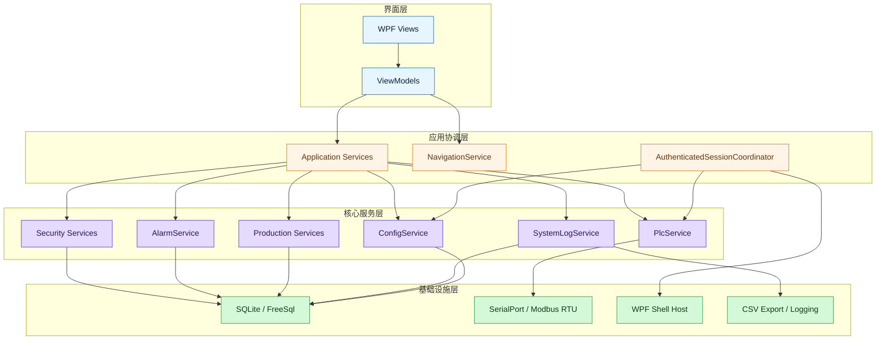
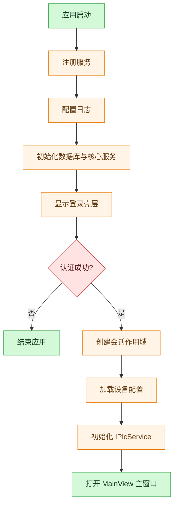
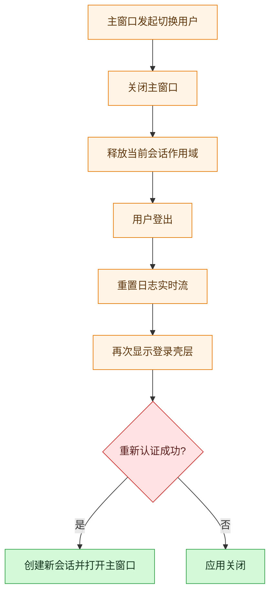
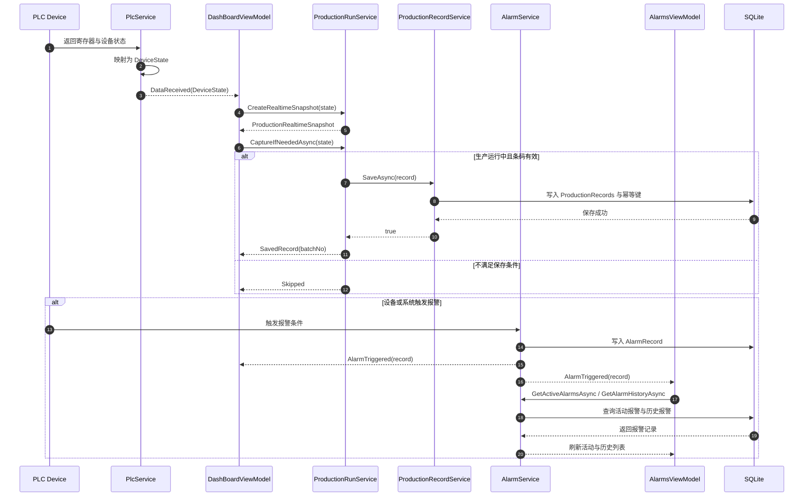
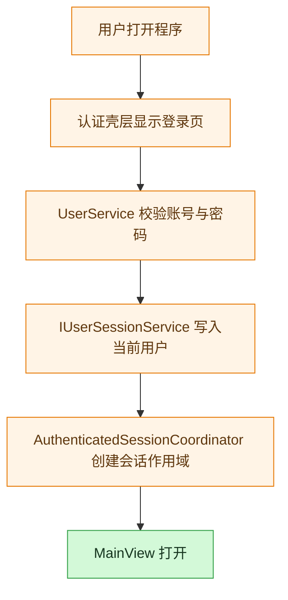
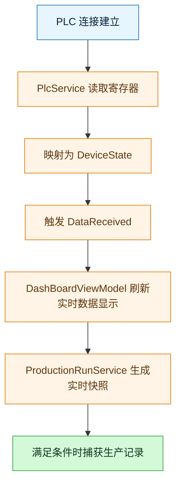
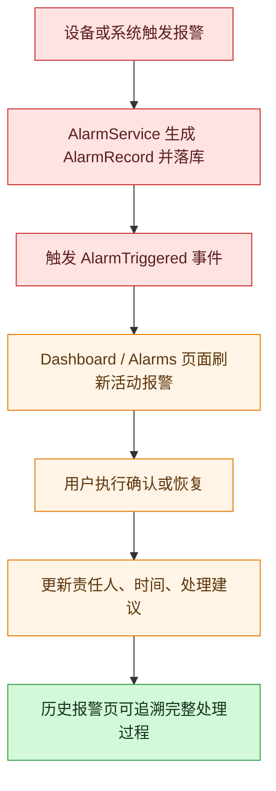

# SmartFillMonitor

## 项目概览

SmartFillMonitor 是一个基于 WPF 的工业监控练习项目，围绕灌装产线的上位机监控场景构建。项目覆盖了登录注册、角色权限、PLC 通信、报警管理、生产记录、日志查询、系统设置和仿真联调等核心能力。

## 整体软件设计架构

### 架构目标

项目采用“WPF 视图 + MVVM 视图模型 + 应用协调入口 + Core Service 核心服务 + Infrastructure 基础设施”的分层结构。

### 总体分层

```text
WPF Views
  -> 负责界面承载、绑定和窗口生命周期

ViewModels
  -> 负责页面状态、命令响应、数据绑定

Application Services
  -> 负责少量跨窗口、跨作用域的流程协调，例如认证会话与主壳层导航

Core Services
  -> 负责单一业务领域能力，如用户、PLC、报警、生产记录、配置、日志

Infrastructure
  -> 负责数据库、串口、UI 线程、导出、窗口宿主等底层实现
```



### 目录结构映射

```text
SmartFillMonitorPractice/
├─ Views/                # WPF 视图
├─ ViewModels/           # 页面状态与命令
├─ Services/
│  ├─ Session/           # 登录后会话协调
│  ├─ Shell/             # WPF 窗口宿主
│  ├─ Navigation/        # 主界面导航
│  ├─ Security/          # 用户、权限、审计
│  ├─ Plc/               # PLC 通信与设备状态采集
│  ├─ Alarms/            # 报警服务与协调
│  ├─ Production/        # 生产运行与生产记录
│  ├─ Configuration/     # 设备参数配置
│  ├─ Logging/           # 系统日志与导出
│  ├─ Persistence/       # SQLite / FreeSql 上下文
│  ├─ Dialogs/           # 对话框服务
│  ├─ Shared/            # 通用抽象
│  └─ Infrastructure/    # 基础设施实现
├─ Models/               # 领域模型与结果对象
└─ Helper/               # 工具类与辅助逻辑
```

### 核心架构主线

#### 1. 启动入口与依赖注入

应用从 `App.xaml.cs` 启动。启动阶段完成 4 件事：

1. 注册所有服务到 `ServiceCollection`
2. 配置 Serilog 日志
3. 初始化核心服务，包括数据库、用户服务、报警服务和生产记录服务
4. 启动认证会话协调器，决定先显示登录壳层还是主业务壳层

这里的设计重点是：应用并不在启动时直接创建主窗口，而是先进入认证流程。这样能把“未登录状态”和“已登录状态”分开管理。

#### 2. 根容器与会话作用域

项目把依赖注入拆成两层：

- 根容器：承载应用级单例服务，如配置、日志、数据库上下文、认证壳层宿主
- 会话作用域：在用户登录成功后创建，承载主窗口、导航、PLC 会话实例和各主页面 ViewModel

这条链路由 `AuthenticatedSessionCoordinator` 负责：

```text
App.OnStartup
  -> IAuthenticatedSessionCoordinator.StartAsync()
  -> 显示认证窗口
  -> 登录成功后 CreateScope()
  -> 加载设备配置
  -> 初始化 IPlcService
  -> 打开 MainView 主窗口
```

#### 3. 主窗口壳层

主业务窗口采用典型的壳层结构：

- `MainView` 负责承载主窗口布局
- `MainViewModel` 负责导航命令、当前用户显示、退出和切换用户流程
- `NavigationService` 负责页面切换与权限拦截
- `HeaderViewModel` 负责顶栏统一状态展示

其中 `MainViewModel` 不直接 new 页面，而是通过 `INavigationService` 切换当前内容。`HeaderViewModel` 也不依赖具体页面类型，而是通过激活当前内容并订阅状态变化，统一展示：

- 当前时间
- PLC 连接状态
- 当前批次或页面上下文
- 设备运行状态灯

这让主窗口壳层保持稳定，页面模块可以独立演进。

#### 4. 应用协调入口

项目没有保留普遍性的页面级 Coordinator，而是只保留少量真正跨窗口、跨作用域的流程入口。典型例子有：

- `AuthenticatedSessionCoordinator`：协调登录、切换用户、退出和会话作用域生命周期
- `NavigationService`：负责主壳层内页面切换、生命周期衔接和权限拦截

页面级查询、导出和表单提交流程则直接收敛在 ViewModel 中，由 ViewModel 调用对应 Core Service。这样能减少中间层跳转，让调用关系更直接。

#### 5. 领域核心服务

核心服务按单一职责划分：

- `UserService`：登录、注册、密码策略、角色边界、用户会话写入
- `AuthorizationService`：权限校验
- `PlcService`：PLC 连接、读写、状态采集、命令下发
- `AlarmService`：报警触发、确认、恢复、历史查询
- `ProductionRunService`：生产运行状态机、启动停止复位、实时快照、生产记录捕获
- `ProductionRecordService`：生产记录保存与查询
- `ConfigService`：设备参数读写、校验、原子写入、损坏备份
- `SystemLogService`：系统日志落库与查询

## 启动与会话生命周期

### 启动阶段

应用启动后的执行顺序可以概括为：



### 切换用户

切换用户不是简单返回登录页，而是一次完整的会话重建：



这个过程保证了页面状态、PLC 连接状态和用户上下文不会残留到下一位用户。

### 退出系统

退出时由会话协调器先关闭主壳层，再由 WPF 宿主执行应用关闭。`MainViewModel`、`HeaderViewModel`、`DashBoardViewModel`、`SimulationViewModel` 等对象在退出前会解除事件订阅，避免资源泄漏和重复触发。

## 核心业务模块设计

### 1. 认证与权限模块

认证模块由登录壳层、`UserService`、`AuthorizationService` 和会话协调器共同组成。

设计重点：

- 启动后先认证，再进入主界面
- 首个用户可以注册为管理员
- 系统已有管理员后，公开注册只能创建工程师
- 主界面导航和关键操作都经过权限校验
- 设置页属于管理员能力，普通工程师会被导航层拦截

这部分不仅解决“能不能登录”，还解决“谁能看到什么页面、谁能执行什么操作”。

### 2. 主界面与导航模块

主界面围绕 `MainViewModel + NavigationService + HeaderViewModel` 组织。

导航职责：

- 维护当前页面 ViewModel
- 处理页面切换
- 在离开仿真页时暂停仿真
- 在进入受限页面时做角色检查

页面本身保持相对独立，目前主界面主要包括：

- Dashboard：真实设备监控
- Simulation：仿真联调
- DashQuery：生产记录查询与导出
- Alarms：活动报警、历史报警、确认与恢复
- Logs：系统日志查询与导出
- Settings：设备参数设置
- AccountSecurity：账号安全能力

### 3. PLC 通信模块

PLC 模块采用 `IPlcService` 作为上层统一入口，底层通过 `IPlcTransport` 和 `ISerialPortService` 对接 Modbus RTU 串口通信。

其职责包括：

- 加载设备参数并初始化连接
- 自动连接与状态同步
- 采集 Holding Register 数据
- 下发启动、停止、复位等命令
- 向上层抛出 `DataReceived` 和 `ConnectionChanged` 事件

### 4. 生产运行模块

生产运行主线由 `ProductionRunService` 负责。它把设备运行从“单纯读 PLC”提升成“可展示、可控制、可落库”的业务流程。

核心职责：

- 根据 PLC 快照维护当前生产状态
- 生成 Dashboard 所需的实时视图模型
- 处理启动、停止、复位命令
- 在运行状态下按条码变化捕获生产记录
- 避免重复保存同一批次记录

Dashboard 页面只关心“展示什么”和“用户点了什么按钮”，生产规则由运行服务统一管理。

### 5. 报警管理模块

报警模块由 `AlarmService + AlarmsViewModel` 组成，覆盖活动报警和历史报警两条线。

它的设计重点在于：

- 活动报警通过事件实时推送到页面
- 历史报警支持分页、时间范围、严重级别筛选
- 报警确认与恢复记录责任人、时间和处理建议
- 页面既能看当前告警，也能做责任追溯

Dashboard 还会在首页维护最近报警列表，形成生产监控首页的摘要视图。

### 6. 配置模块

配置模块由 `ConfigService` 管理设备参数文件。它不是简单地“读写 JSON”，而是做了几层保护：

- 默认配置生成
- 参数合法性校验
- 原子写入，降低半写入损坏风险
- 损坏配置文件备份恢复
- 保存操作权限校验和审计记录

这让配置管理更接近真实工业软件的处理方式。

### 7. 日志与审计模块

日志模块使用 Serilog，同时覆盖文本日志、实时日志流和数据库日志查询能力。

它承担 3 类职责：

- 运行日志：记录启动、连接、加载、异常等系统行为
- 审计日志：记录注册、设置保存、关键操作等用户行为
- 查询导出：支持在日志页面筛选、查看和导出

## 关键数据流与事件流



### 1. 登录流



### 2. 设备监控流



### 3. 报警流



## 技术栈

- .NET 8
- WPF
- CommunityToolkit.Mvvm
- FreeSql
- SQLite
- Serilog
- LiveChartsCore.SkiaSharpView.WPF
- NModbus
- CsvHelper
- xUnit

## 数据存储与配置

### 数据库

- 数据库类型：SQLite
- 默认数据库文件：`SmartFillMonitor.db`

### 主要表

- `Users`
- `AlarmRecord`
- `ProductionRecords`
- `SystemLog`

### 配置文件

- 设备配置文件：`device-settings.json`
- 日志文件：`Logs\\log-*.txt`

## 如何运行项目

### 1. 构建

```powershell
dotnet build .\SmartFillMonitor.slnx -c Debug --no-restore
```

### 2. 启动

可直接在 Visual Studio 中启动 `SmartFillMonitor` 主项目，或运行输出目录中的可执行文件。

### 3. 首次使用

- 如果系统内没有任何用户，先在登录页注册首个管理员。
- 注册成功后返回登录页，使用账号密码进入系统。
- 登录成功后，程序会创建会话作用域并初始化 PLC 服务。
