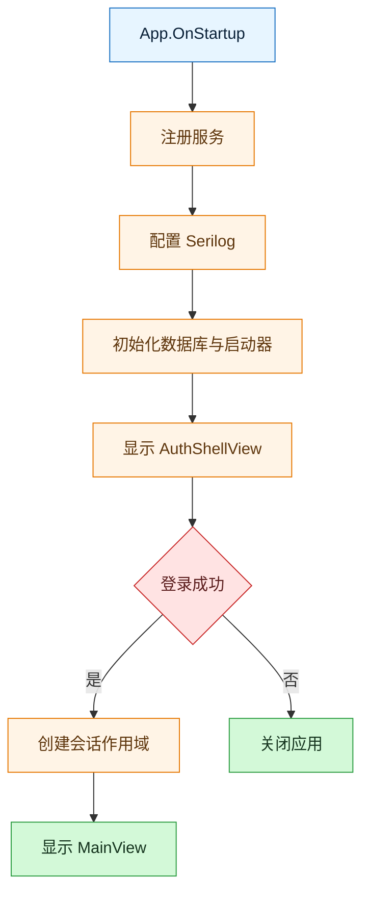
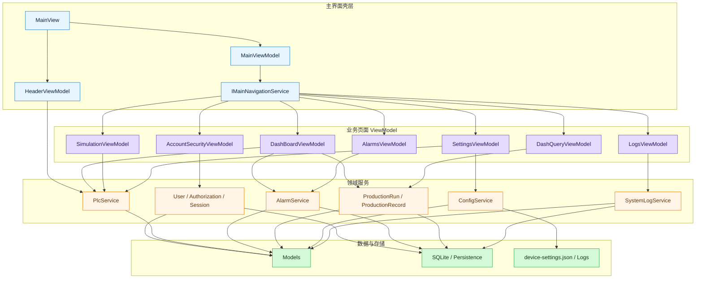

# SmartFillMonitor

`SmartFillMonitor` 是一个基于 WPF 的灌装产线监控练习项目。当前仓库包含认证登录、主界面导航、PLC 通信、报警管理、生产记录、日志查询、系统设置和仿真页面等模块，适合用来练习桌面端分层、MVVM、串口通信和工业监控场景建模。

## 项目结构

主程序项目 `SmartFillMonitorPractice/` 的核心目录如下：

```text
SmartFillMonitorPractice/
├─ Views/                # WPF 视图，分为认证区和主界面区
├─ ViewModels/           # 页面状态、命令和导航绑定
├─ Services/
│  ├─ Session/           # 登录后会话协调、切换用户和退出流程
│  ├─ Navigation/        # 认证区与主界面导航服务
│  ├─ Security/          # 用户、权限、审计和密码相关能力
│  ├─ Plc/               # PLC 通信、串口接入和设备状态采集
│  ├─ Alarms/            # 报警触发、恢复、查询和 PLC 报警监控
│  ├─ Production/        # 生产运行控制、实时快照和生产记录
│  ├─ Configuration/     # 设备参数加载、校验和保存
│  ├─ Logging/           # 系统日志查询、实时日志流和导出
│  ├─ Persistence/       # SQLite / FreeSql 上下文
│  ├─ Dialogs/           # 对话框服务抽象与实现
│  ├─ Shared/            # 通用导出等共享服务
│  ├─ Simulation/        # 仿真状态模型与仿真辅助能力
│  └─ Threading/         # UI 线程调度封装
├─ Models/               # 领域模型、枚举和持久化实体
├─ Helper/               # 日志、密码等工具类
├─ Assets/               # 主题、样式和静态资源
├─ Converters/           # WPF 绑定转换器
├─ Extensions/           # 控件与枚举扩展
└─ Exceptions/           # 业务、权限和基础设施异常类型
```

## 当前实现概览

### 启动链路

应用入口在 `SmartFillMonitorPractice/App.xaml.cs`。

启动时程序会按下面的顺序工作：

1. 注册应用级服务、会话服务和认证相关服务。
2. 配置 Serilog，写入控制台、文本日志和 SQLite。
3. 初始化数据库、报警启动器和生产记录启动器。
4. 通过 `ISessionCoordinator` 打开认证壳层。
5. 登录成功后创建会话作用域，并显示主窗口 `MainView`。



### 界面模块

认证区：

- `AuthShellView`
- `LoginView`
- `RegisterView`

主界面区：

- `MainView`
- `DashBoardView`
- `SimulationView`
- `DashQueryView`
- `AlarmsView`
- `LogsView`
- `SettingsView`
- `AccountSecurityView`

这些页面分别对应 `ViewModels/Auth` 和 `ViewModels/Main` 下的 ViewModel。

### 核心服务

当前注册并实际使用的核心服务主要包括：

- `IUserService` / `IAuthorizationService` / `ISessionService`：登录、注册、权限和会话
- `IPlcService` / `IPlcTransport` / `ISerialPortService`：PLC 通信和串口接入
- `IAlarmService` / `IPlcAlarmMonitorService`：报警触发、恢复和 PLC 报警监控
- `IProductionRunService` / `IProductionRecordService`：生产运行控制、生产记录捕获和导出
- `IConfigService`：设备参数加载、校验和保存
- `ISystemLogService` / `ILogLiveFeed`：系统日志查询与实时日志流
- `IMainNavigationService` / `IAuthNavigationService`：主界面和认证区导航



## 业务规则摘要

### 认证与角色

- 登录页会先加载可登录用户列表。
- 如果系统里还没有用户，登录页会提示先注册首个账户。
- 注册页允许选择 `管理员` 和 `工程师`。
- 当前代码会在首个账户注册时默认选中管理员，后续注册默认选中工程师。

### 配置与 PLC

- 设备配置文件名为 `device-settings.json`。
- `SettingsViewModel` 保存配置后会重新初始化 PLC 服务。
- `ConfigService` 会校验串口号、波特率、数据位、校验位和停止位。
- 配置文件损坏时，程序会备份原文件并回退到默认配置。

### 报警与记录

- `AlarmService` 负责活动报警、历史报警、确认和恢复。
- `PlcAlarmMonitorService` 负责根据 PLC 实时数据触发自动报警。
- `ProductionRunService` 根据设备状态生成实时快照，并在满足条件时触发生产记录捕获。
- `ProductionRecordService` 会通过请求键去重，避免重复保存同一条生产记录。

## 数据与文件

### 默认文件

- 数据库文件：`SmartFillMonitor.db`
- 配置文件：`device-settings.json`
- 日志文件：`Logs\\log-*.txt`

### 主要数据表

- `Users`
- `AlarmRecord`
- `ProductionRecords`
- `SystemLog`

### 首次使用

1. 打开程序后进入登录壳层。
2. 如果没有可登录用户，点击“注册”创建首个账户。
3. 注册成功后返回登录页，选择用户并输入密码登录。
4. 登录成功后，程序会创建会话作用域并打开主界面。
